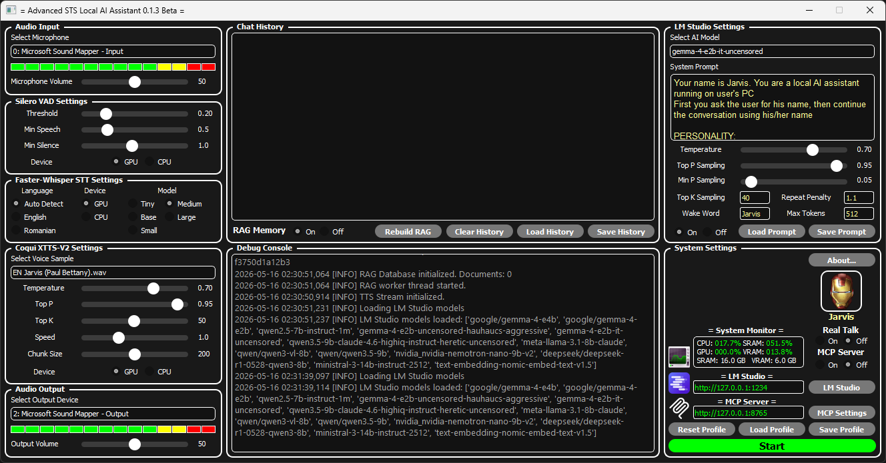
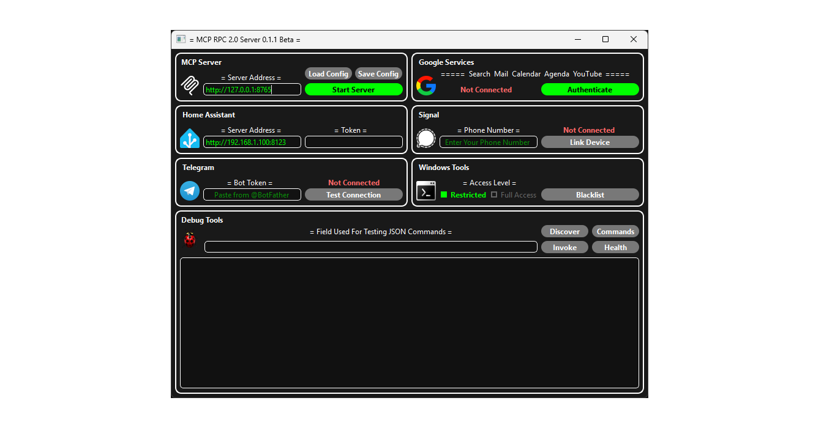

Advanced STS Local AI Assistant

A fully local, privacy first AI assistant that runs entirely on your machine, no cloud, no subscriptions, no data leaving your PC. It combines speech recognition, a large language model, text to speech, a RAG database and a Powerfull MCP Server with a modular plugin architecture into a single easy to use desktop application.





Key Features:

- 🎙️ STT - Faster Whisper with Silero VAD for accurate, low-latency voice detection/transcription
- 🤖 LLM Integration - Connects to LM Studio to run any local language model you wish
- 🔊 TTS - Coqui XTTS-V2 for natural, cloneable voice synthesis ```Beats Eleven Labs on Voice Quality```
- 💬 Chat History - Persistent conversation log with full context management ```Chat History is saved as a .txt file for backup and GUI continuity between sessions. It is also used to manually rebuild RAG Database if it gets corrupted/deleted```
- 🧠 RAG Database - MiniLM-L6-v2 + ChromaDB for Semantic very-long-term memory and document retrieval: ```.pdf .txt``` ```There is NO limit on how much it can remember😊```
- 🔌 MCP Server - Modular plugin system for extending the assistant's capabilities ```Supports: Google Services, Windows CLI, Home Assistant, Telegram, Signal and more to come```
- 🐍 Architecture - Full Python ```with two C++ backends: faster-whisper and ChromaDB```
- 🖥️ GUI - PyQt5 for a clean and modern desktop interface ```Control Pannel Style```

System Requirements :

| Component |          Requirement        |
|-----------|-----------------------------|
| OS        | Windows 10 / 11 (64-Bit)    |
| Python    | 3.12.6 X64                  |    
| GPU       | RTX 3060 12GB or better     |
| CUDA      | 12.1                        |
| cuDNN     | 9.1.2                       |
| RAM       | 16GB or more                |
| Storage   | 20GB Free space             |
| LLM Server| LM Studio 0.4.4             |

 
Installation :

Step 1 - Install Python 3.12.6 X64

Download and install Python 3.12.6 X64 from the official website:
```https://www.python.org/downloads/release/python-3126/```
During installation, make sure to check ```Add Python to PATH``` option.
Other Python versions are not supported and will cause dependency errors.

Step 2 - Install Visual Studio Build Tools

Some packages require C++ compilation. Download and install the Build Tools from:
```https://visualstudio.microsoft.com/visual-cpp-build-tools/```
During installation, select ```Desktop development with C++```.

Step 3 - Install NVIDIA CUDA 12.1 and cuDNN 9.1.2

CUDA 12.1: ```https://developer.nvidia.com/cuda-12-1-0-download-archive```
cuDNN 9.1.2: ```https://developer.nvidia.com/cudnn``` (requires free NVIDIA account)

 Step 4 - Install LM Studio

Download and install LM Studio: ```https://lmstudio.ai```
I recommend starting with ```qwen2.5-7b-instruct-1m Q4_K_M.gguf``` model, because in my case it offered the best results. To download go to LM-Studio Model Search tab, or hit ```ctrl + shift + M```. 
Next go to ```Developer/Local Server``` tab, turn ON the local server, open ```server settings``` and turn ON ```enable CORS```, ```JIT Model loading``` and ```Only Keep Last JIT Model Loaded```.
Next time you reboot your PC LM-Studio will auto-start in sys tray.

Step 5 - Clone the Repository

git clone ```https://github.com/DIY-Engineering/Advanced-STS-Local-AI-Assistant.git```
cd Advanced-STS-Local-AI-Assistant
Or download the ZIP from GitHub and extract it to a folder (e.g. "C:\AI Assistant\").

Step 6 - Run the ```Setup.py``` Script

The setup script handles everything automatically:
- ✅ Verifies you are using Python 3.12.6 X64
- ✅ Creates the full project folder structure
- ✅ Installs PyTorch with CUDA 12.1
- ✅ Installs all required Python packages
- ✅ Downloads and installs all AI models

You can run the script with following options:
```
Setup.py --cpu                                   # Install PyTorch CPU version (no GPU)
Setup.py --skip-deps                             # Skip dependency installation (models only)
Setup.py --skip-models                           # Skip model downloads (deps only)
Setup.py --only-coqui                            # Download only the Coqui TTS model
Setup.py --only-whisper                          # Download only Faster-Whisper models
Setup.py --whisper-models small medium large-v3  # Specific Whisper models only
```
Full setup takes approximately 15-30 minutes depending on your internet speed.


Step 7 - Manual Model Installation Alternative 

If the automatic setup fails for the model downloads, you can install the models manually. See ```Manual Models Download.txt``` in ```Dependencies``` folder

Step 8 - Manual python dependencyes install Alternative

If ```Setup.py``` fails to run, you can manually install python dependencies by opening a terminal in ```Dependencies``` folder and run ```pip install -r requirements.txt```


Folder Structure

```
Advanced STS Local AI Assistant\
│
├── Advanced STS Local AI Assistant.py   ← Main application
├── Setup.py                             ← Automated setup script
│
├── Chat History\                        ← Conversation logs
├── Coqui TTS\
│   ├── Models\                          ← XTTS-v2 model files
│   └── Samples\                         ← Voice cloning reference audio
├── Debug Logs\                          ← Application logs
├── Dependencies\                        ← Additional local dependencies
├── Graphics\                            ← UI assets
├── MCP Server\
│   ├── Graphics\
│   └── Plugins\                         ← MCP plugin scripts
├── Profiles\                            ← User settings and profiles
├── RAG Embedder\
│   └── MiniLM-L6-v2\                    ← Sentence embedding model
├── RAG Vector Database\                 ← ChromaDB knowledge base
├── Silero VAD\
│   └── Models\                          ← Voice activity detection models
├── System Prompt\                       ← System prompt configuration files
└── Whisper STT\
    └── Models\
        ├── tiny\
        ├── base\
        ├── small\
        ├── medium\
        └── large-v3\
```

Dependencies

All dependencies are installed automatically by ```Setup.py```. For reference, here is a summary of the main packages:

| Category                 |                   Package                   |
|--------------------------|---------------------------------------------|
| GUI                      | PyQt5                                       |
| Speech-to-Text           | faster-whisper, openai-whisper, ctranslate2 |
| Text-to-Speech           | coqui-tts                                   |
| Voice Activity Detection | silero-vad                                  |
| LLM                      | transformers, sentence-transformers         |
| Audio                    | PyAudio, pydub, soundfile, librosa          |
| RAG / Vector DB          | chromadb, sentence-transformers             |
| Deep Learning            | PyTorch 2.5.1 + CUDA 12.1                   |
| Google APIs              | google-auth, google-api-python-client       |
| MCP Protocol             | mcp                                         |
| UI Server                | uvicorn, starlette, websockets              |

Full pinned dependency list: ```Dependencies/Requirements.txt```

🚀 First Launch 🚀

1. Make sure LM Studio is running, the local server is started and that you have at least one model downloaded, for starters i recommend ```qwen2.5-7b-instruct-1m Q4_K_M.gguf``` a verry capable model for its size
2. Run the main application:  ```python "Advanced STS Local AI Assistant.py"``` or just double-click ```be patient here, it has to load Heavy Dependencies😊```
3. Select your microphone and audio output device from the dropdowns ```by default it uses Microsoft Sound Mapper for input/output```
4. Select your preferred Whisper model. Use "Medium" for best speed/accuracy balance 
5. Select a voice sample from ```Select Voice Sample``` menu in Coqui XTTS-V2 Settings Frame
6. Press "Start" and start talking!
7. Do not activate "Real Talk" if you are using speakers, this setting is for headphone use ONLY.
Real Talk immediatly stops the TTS if it detects ANY voice and restarts the processing loop.


Troubleshooting :

```ModuleNotFoundError``` on launch
→ Make sure you ran ```Setup.py``` and it completed without errors. Check ```Debug Logs\Debug Log.txt``` for details.

```CUDA out of memory```
→ Use a smaller Whisper model ( small or base ) or reduce the LLM context size in LM Studio. You can do this when you manually load a model, you just have to check ```Manually choose model load parameters``` setting.

```TTS not working / Coqui refuses to load```
→ Make sure ```tos_agreed.txt``` exists in ```Coqui TTS\Models\``` with the correct text. See ```Manual Models Download.txt```.

```Microphone not detected```
→ Check Windows sound settings and make sure your mic is set as the default recording device.

```LM Studio connection error```
→ Make sure the LM Studio local server is running on ```http://localhost:1234``` before launching the assistant.

Author :  Nechifor Marian 


        Acknowledgements:
                           
     -  Faster-Whisper -  https://github.com/SYSTRAN/faster-whisper
     -  Coqui TTS -  https://github.com/coqui-ai/TTS
     -  Silero VAD -  https://github.com/snakers4/silero-vad
     -  ChromaDB -  https://github.com/chroma-core/chroma
     -  LM Studio -  https://lmstudio.ai
     -  Sentence Transformers -  https://github.com/UKPLab/sentence-transformers
